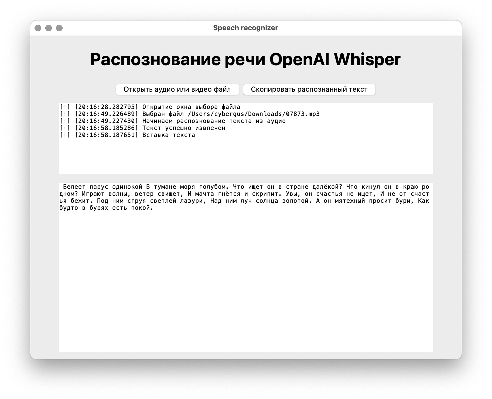

# Speecher
Speecher — простое GUI приложение на python для локального распознавание голоса из медиа файлов. Для графического интерфейса используется tkinter, а для распознавания текста из аудио — модель OpenAI Whisper. При выборе медиа файлов идет проверка: это аудио или видео? Если второе, то сначала извлекается аудиодорожка средствами ffmpeg, а уже потом идет основная логика распознавания.

---

### Требования:
|            |        |
| ---------- | ------ |
| Python     | >= 3.9 |
| ffmpeg     | any    |
| RAM        | >= 8Gb |
| ROM        | >= 2Gb |

---

- [x] 0% кода написано ИИ
- [x] Графический интерфейс
- [x] Командый интерфейс
- [x] Локальное распознавание
- [x] Минимализм
- [x] Логирование

---

### Установка [ffmpeg](https://ffmpeg.org/):
```
# debian-based
sudo apt update && sudo apt install ffmpeg

# arch-based
sudo pacman -S ffmpeg

# macos (https://brew.sh/)
brew install ffmpeg

# windows (https://chocolatey.org/)
choco install ffmpeg

# windows (https://scoop.sh/)
scoop install ffmpeg
```

### Клонирование репозитория:
```
git clone https://github.com/cybergusik/Speecher.git
cd Speecher
```

### Создание и активация виртуального окружения(опционально):
```
# unix-based
python3 -m venv .venv
source .venv/bin/activate

# windows
python -m venv venv
venv\Scripts\activate
```

### Установка зависимостей:
```
# unix-based
pip3 install -r requirements.txt

# windows
pip install -r requirements.txt
```

---

> [!IMPORTANT]
> При первом запуске скачается модель turbo, объемом ≈ 2Gb. Убедитесь, что вы готовы к установке

### Запуск:
Графический интерфейс:
```
# unix-based
python3 gui.py

# windows
python gui.py
```
Также есть поддержка командой строки:
```
Аргументы:
    --video <path_to_video_file>
    --audio <path_to_audio_file>
```
**Поддерживаемые форматы:**

Видео:
- [x] mp4
- [x] mov
- [x] avi
- [x] mkv
- [x] webm
- [x] flv
- [x] f4v
- [x] wmv
- [x] mpeg
- [x] mpg
- [x] ogv
- [x] gif

Аудио:
- [x] mp3
- [x] wav
- [x] m4a
- [x] flac
- [x] aac
- [x] ogg
- [x] wma

### To-Do:
- [ ] Добавить поддержку [GigaAM](https://github.com/salute-developers/GigaAM)
- [ ] Сделать сохранение промежуточных результатов и уже полностью обработанных данных в кэш
