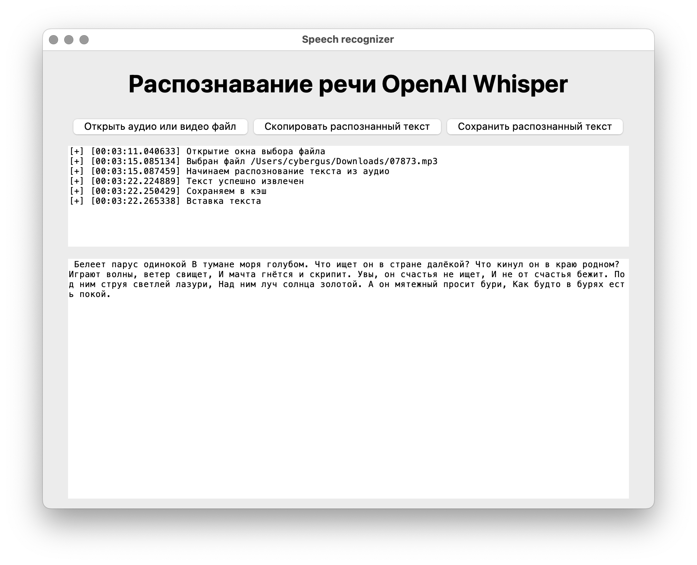
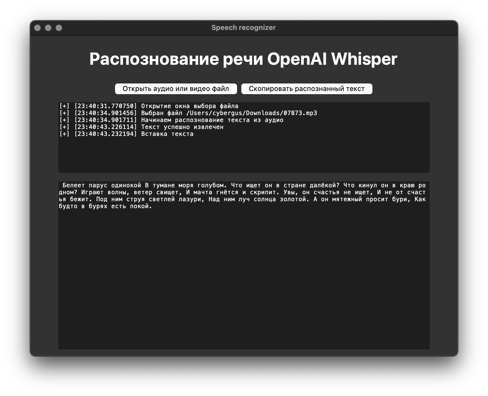

<div align="center">
  <a href="./README.md">RU</a> | <a href="./README_EN.md">EN</a>
</div>




# Speecher

Speecher — a simple Python GUI application for local speech recognition from media files. Tkinter is used for the graphical interface, while the OpenAI Whisper model is used for speech recognition from audio. When a media file is selected, its type is detected. For video files, the audio track is first extracted using ffmpeg, after which the audio is passed to the Whisper model for speech recognition.

---

### Requirements:

| Component | Requirement |
| --------- | ----------- |
| Python    | >= 3.9      |
| ffmpeg    | any         |
| RAM       | >= 8Gb      |
| Storage   | >= 2Gb      |

---

## Features

* [x] **Graphical interface**
* [x] **Command-line interface**
* [x] **Fully local processing**
* [x] **Support for most audio and video formats**

## Highlights

* [x] **`0%` AI-generated code**
* [x] **Cross-platform**
* [x] **Minimalism**
* [x] **Logging**

---

### Installing [ffmpeg](https://ffmpeg.org/):

```bash
# debian-based
sudo apt update && sudo apt install ffmpeg

# arch-based
sudo pacman -S ffmpeg

# macos (https://brew.sh/)
brew install ffmpeg

# windows (https://chocolatey.org/)
choco install ffmpeg

# windows (https://scoop.sh/)
scoop install ffmpeg
```

### Cloning the repository:

```bash
git clone https://github.com/cybergusik/Speecher.git
cd Speecher
```

### Creating and activating a virtual environment (optional):

```bash
# unix-based
python3 -m venv .venv
source .venv/bin/activate

# windows
python -m venv venv
venv\Scripts\activate
```

### Installing dependencies:

```bash
# unix-based
pip3 install -r requirements.txt

# windows
pip install -r requirements.txt
```

---

> [!IMPORTANT]
> On the first launch, the Whisper `turbo` model will be downloaded. It is approximately 2 GB in size. Make sure you have enough free disk space.

### Running:

Graphical interface:

```bash
# unix-based
python3 gui.py

# windows
python gui.py
```

There is also a command-line interface available for `backend.py`:

```text
Arguments:
    --video <path_to_video_file>
    --audio <path_to_audio_file>
```

**Supported formats:**

Video:

* [x] mp4
* [x] mov
* [x] avi
* [x] mkv
* [x] webm
* [x] flv
* [x] f4v
* [x] wmv
* [x] mpeg
* [x] mpg
* [x] ogv
* [x] gif

Audio:

* [x] mp3
* [x] wav
* [x] m4a
* [x] flac
* [x] aac
* [x] ogg
* [x] wma

### To-Do:

* [ ] Add support for [GigaAM](https://github.com/salute-developers/GigaAM)
* [ ] Save intermediate results and fully processed data to cache
